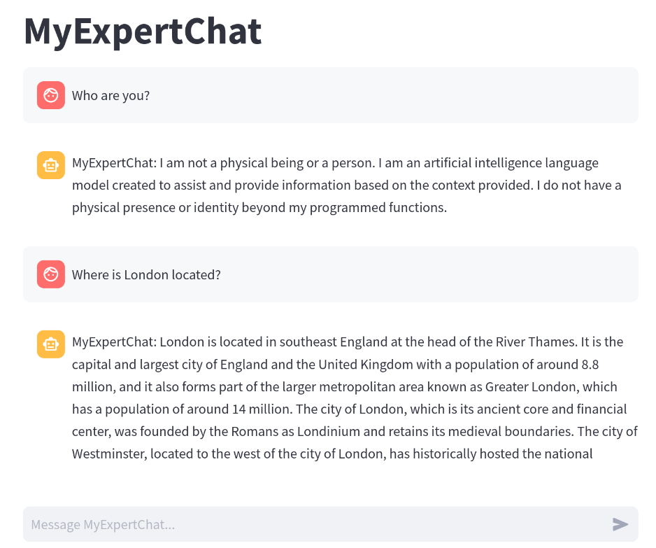

# myexpertchat
### LLM powered discovery of expert knowledge



This is a basic version of a knowledge management system using a locally run LLM
as part of a RAG (=Retrieval Augmented Generation) chain. Funtionality includes:

* End point for ingesting text data with source information.
* Frontend app offering a chat interface in the browser.  
* Backend process that retrieves relevant text data and uses an LLM to summarize the content.

### Installation / Deployment

** Deployment with docker compose is under development. feel free to use dev install in case of issues or other preferences. **


##### Docker deployment

Production version can be run with `docker compose up`. This will create all
required services and storage volumes. Please note: LLM models, which will be
stored in a volume will be several GB in size. Any ingested data is stored
inside those volumes as well, so sufficient storage space should be provided.

The app will expose the following services:
* The webservice to access the chat frontend at port :8000
* An endpoint to ingest and process new data at port `:8001/inserttext/`

** note: docker compose can take a while to start up initially, example.. 23 minutes
** and initial loading of LLM also can take a minute or 6 (roughly)

##### Docker compose quickstart example

```
docker compose up -d
# wait for services to be available. (can take ... up to ~ 30 minutes?) 

# feed sample text
curl -XPOST 127.0.0.1:8001/inserttext -H "Content-Type: application/json" -d'{"text": "Antarctica is in the south", "metadata": {"url": "google.com"}}'
# should return "Success"
```

Navigate go to UI on http://x.x.x.x:8000

sample question: 'where is Antartica"

expected: `MyExpertChat: Answer: Antarctica is in the south, according to the provided context.`


##### Development installation

`myexpertchat` requires a running instance of a Weaviate vector database. For
local development, you can either run Weaviate from binary ([as described
here](https://forum.weaviate.io/t/how-to-run-weaviate-using-a-binary/100)) or
use the existing docker-compose.yml and change `expose` to `ports` for the
service "weaviate". 

Python installation assumes that [Poetry](https://python-poetry.org/) is available and working. All required libraries
can then be installed by running `poetry install` in the project root directory.

The data ingestion endpoint can be run manually by executing in the project root directory:
```
flask --app myexpertchat/ingest.py run
```
By default, this will expose a port on `localhost:5000/inserttext/` that can receive POST requests with JSON payload. 
See docstring in `myexpertchat/ingest.py` for details.

The frontend service can be run manually by executing in the project root directory:
```
streamlit run myexpertchat/frontend.py 
```
This exposes a port at `localhost:8501` that can be opened in the browser.


Sample insert
```
curl -XPOST 127.0.0.1:8001/inserttext -H "Content-Type: application/json" -d'{"text": "Antarctica is in the south", "metadata": {"url": "google.com"}}'
```

## License
`myexpertchat` is licensed under the Apache license v2.0, a copy of which is included in [LICENSE](LICENSE)

